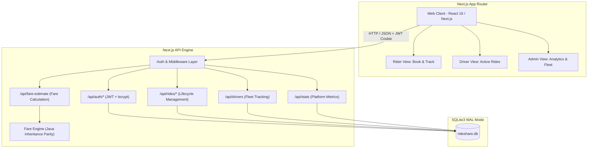
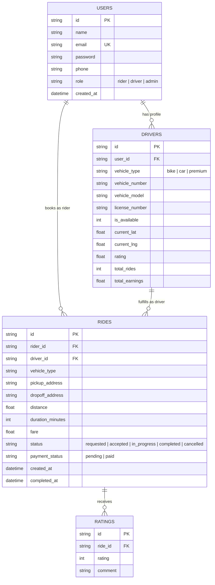

# 🚖 RideShare Pro — Full-Stack Ride Sharing Platform

<div align="center">

[](https://nextjs.org/)
[](https://react.dev/)
[](https://www.sqlite.org/)
[](https://nodejs.org/)
[](https://render.com/)
[](LICENSE)

**An enterprise-grade, modern full-stack ride-hailing web platform built with Next.js App Router, SQLite (WAL mode), and a high-performance fare calculation engine evolved from core Object-Oriented Java principles.**

[Explore Features](#-key-features) • [Quickstart](#-getting-started) • [API Docs](#-api-reference) • [Deploy to Render](#-deploy-to-render)

</div>

---

## 📋 Table of Contents

- [Overview](#-overview)
- [System Architecture](#-system-architecture)
- [Key Features](#-key-features)
  - [Rider Portal](#1-rider-portal)
  - [Driver Dashboard](#2-driver-dashboard)
  - [Admin Command Center](#3-admin-command-center)
  - [Fare Engine (Java Heritage)](#4-dynamic-fare-engine-java-heritage)
- [Live Demo Credentials](#-live-demo-credentials)
- [Database Schema](#-database-schema)
- [API Reference](#-api-reference)
- [Getting Started](#-getting-started)
- [Deploy to Render](#-deploy-to-render)
- [Project Structure](#-project-structure)
- [Contributing](#-contributing)
- [License](#-license)

---

## 🌟 Overview

**RideShare Pro** transforms traditional object-oriented transportation logic into a responsive, real-time web application. Originally developed as a Java console system implementing polymorphic vehicle calculations (`BikeRide`, `CarRide`, `Ride`), this platform extends the foundation into a production-ready web application featuring:

- **Role-Based Access Control (RBAC)**: Distinct interfaces and permissions for Riders, Drivers, and Platform Administrators.
- **Dynamic Pricing Engine**: Distance-based calculation, surge pricing factors, and vehicle tier multipliers.
- **High-Performance Embedded Storage**: SQLite with WAL (Write-Ahead Logging) mode and foreign key constraints via `better-sqlite3`.
- **Zero-Dependency Styling**: Modern, fluid UI design system implemented in Vanilla CSS with glassmorphism, responsive navigation, and micro-interactions.

---

## 🏗️ System Architecture



---

## ✨ Key Features

### 1. 🚶 Rider Portal
- **Interactive Trip Planner**: Choose pickup and dropoff points across key city hubs.
- **Instant Vehicle Selection**: Compare rates and ETAs across **Bike**, **Car**, and **Premium** tiers.
- **Live Fare Calculator**: Real-time breakdown of base fare, distance rate, and surge multiplier.
- **Ride History**: Detailed audit trail of past rides, timestamps, driver details, and payment receipts.

### 2. 🚖 Driver Dashboard
- **Duty Toggle**: Instant online/offline switch controlling ride availability.
- **Real-Time Dispatch**: Receive incoming trip requests matching vehicle category.
- **Trip Lifecycle Controls**: Update ride status through sequential stages: `Arrived` ➔ `In Progress` ➔ `Completed`.
- **Earnings Tracker**: Total rides completed, cumulative revenue, and driver rating monitor.

### 3. 🛡️ Admin Command Center
- **Fleet Overview**: Monitor active drivers, online status, vehicle types, and locations.
- **Financial Metrics**: Platform gross merchandise value (GMV), total completed rides, and system user counts.
- **System Activity Log**: Full ledger of recent transactions and ride events.

### 4. ⚡ Dynamic Fare Engine (Java Heritage)
The core pricing engine maintains 1:1 mathematical parity with the original Java OOP implementation while introducing modern dynamic capabilities:

| Vehicle Class | Base Rate | Per-Km Rate (Java Base) | Base Minimum | Features |
|---|---|---|---|---|
| **BikeRide** | ₹25 | ₹10 / km | ₹40 | Solo travel, rapid traffic navigation |
| **CarRide** | ₹40 | ₹20 / km | ₹70 | Up to 4 passengers, air-conditioned |
| **PremiumRide** | ₹80 | ₹35 / km | ₹150 | Luxury sedans & SUVs, top-rated drivers |

---

## 🔑 Live Demo Credentials

The database is pre-seeded with test profiles for all roles:

| Role | Email | Password | Assigned Vehicle / Profile |
|---|---|---|---|
| **Rider** | `vivek@rideshare.com` | `password123` | Vivek Sharma (Rider account with past trips) |
| **Driver (Bike)** | `utkarsh@rideshare.com` | `password123` | Utkarsh Anand • Royal Enfield Classic 350 (`MH12AB1234`) |
| **Driver (Car)** | `jaya@rideshare.com` | `password123` | Jaya Shankar • Maruti Suzuki Swift (`MH14XY5678`) |
| **Admin** | `admin@rideshare.com` | `admin123` | Platform Administrator • Full metrics access |

---

## 🗄️ Database Schema



---

## 📡 API Reference

### Authentication
| Method | Endpoint | Description | Auth Required |
|---|---|---|---|
| `POST` | `/api/auth/register` | Register new rider or driver account | No |
| `POST` | `/api/auth/login` | Authenticate user, return profile and JWT | No |

### Rides & Fare
| Method | Endpoint | Description | Auth Required |
|---|---|---|---|
| `POST` | `/api/fare-estimate` | Calculate fare breakdown for distance & duration | No |
| `GET` | `/api/rides` | List user rides (riders see bookings, drivers see dispatches) | Yes |
| `POST` | `/api/rides` | Request a new ride | Yes (Rider) |
| `PATCH` | `/api/rides/[id]` | Update ride status (`accepted`, `in_progress`, `completed`) | Yes (Driver) |

### Fleet & Operations
| Method | Endpoint | Description | Auth Required |
|---|---|---|---|
| `GET` | `/api/drivers` | Fetch available driver fleet | Yes |
| `GET` | `/api/stats` | Platform-wide operational metrics | Yes (Admin) |

---

## 🚀 Getting Started

### Prerequisites
- **Node.js**: `v20.0.0` or higher
- **npm**: `v10.0.0` or higher
- **Git**

### Installation

```bash
# 1. Clone repository
git clone https://github.com/vckshood/rideshare.git
cd rideshare

# 2. Install dependencies
npm install

# 3. Create environment configuration
cp .env.example .env.local

# 4. Start development server
npm run dev
```

Open [http://localhost:3000](http://localhost:3000) in your browser. The database initializes and seeds test data automatically on first launch.

### Running Tests & Build Validation

```bash
# Production compilation test
npm run build

# Start production server locally
npm run start
```

---

## 🌐 Deploy to Render

This repository includes a native [`render.yaml`](render.yaml) blueprint for automated deployment.

### Option 1: Render Blueprint (Recommended)
1. Push this repository to **GitHub**.
2. Visit [Render Dashboard](https://dashboard.render.com/) and click **New +** ➔ **Blueprint**.
3. Select your repository. Render automatically reads `render.yaml` and provisions:
   - **Service Type**: Web Service
   - **Environment**: Node 20
   - **Build Command**: `npm install && npm run build`
   - **Start Command**: `npm start`
4. Click **Apply** to trigger build.

### Option 2: Manual Web Service
1. Click **New +** ➔ **Web Service** in Render.
2. Connect your repository.
3. Configure the following settings:
   - **Runtime**: `Node`
   - **Build Command**: `npm install && npm run build`
   - **Start Command**: `npm start`
   - **Plan**: `Free`
4. Set Environment Variables:
   - `NODE_VERSION` = `22.14.0` (or 20+)
   - `JWT_SECRET` = *(Generate random 32-byte secret)*
   - `NEXT_TELEMETRY_DISABLED` = `1`

> **Note on Storage**: For free instances, SQLite runs directly on ephemeral storage with automatic seeding on restart. For persistent state between redeploys on Render Paid plans, attach a **Persistent Disk** mounted at `/var/data` and set `DATABASE_PATH=/var/data/rideshare.db`.

---

## 📁 Project Structure

```text
rideshare/
├── .github/
│   ├── ISSUE_TEMPLATE/
│   │   ├── bug_report.md
│   │   └── feature_request.md
│   └── PULL_REQUEST_TEMPLATE.md
├── java/                         # Original Java OOP source files
│   ├── BikeRide.class
│   ├── CarRide.class
│   ├── InvalidRideTypeException.class
│   ├── Ride.class
│   ├── RideSharingSystem.class
│   ├── RideSharingSystem.java    # Reference console system
│   └── utkarsh.java
├── src/
│   ├── app/
│   │   ├── api/                  # RESTful API Endpoints
│   │   │   ├── auth/
│   │   │   ├── drivers/
│   │   │   ├── fare-estimate/
│   │   │   ├── rides/
│   │   │   └── stats/
│   │   ├── globals.css           # Design tokens, typography & CSS theme
│   │   ├── layout.js             # Root layout with SEO metadata
│   │   └── page.js               # Entry view & auth routing
│   ├── components/               # Modular UI Components
│   │   ├── AdminPanel.js         # Platform analytics dashboard
│   │   ├── BookRide.js           # Trip booking interface
│   │   ├── Dashboard.js          # App shell & role navigation
│   │   ├── DriverPanel.js        # Driver trip acceptance & status
│   │   └── MyRides.js            # User trip audit log
│   ├── context/
│   │   └── AuthContext.js        # Global user session state
│   └── lib/
│       ├── auth.js               # JWT verification & password hashing
│       ├── db.js                 # SQLite database connection & seeder
│       └── fareEngine.js         # Java parity calculation engine
├── .env.example                  # Environment configuration template
├── CODE_OF_CONDUCT.md            # Contributor covenant
├── CONTRIBUTING.md               # Contribution workflow
├── LICENSE                       # MIT License
├── next.config.mjs               # Next.js native module configuration
├── package.json
└── render.yaml                   # Render Cloud deployment blueprint
```

---

## 🤝 Contributing

Contributions, issues, and feature requests are welcome!  
Please review the [Contribution Guidelines](CONTRIBUTING.md) and [Code of Conduct](CODE_OF_CONDUCT.md) before submitting pull requests.

---

## 📄 License

This project is open-source and licensed under the [MIT License](LICENSE).
